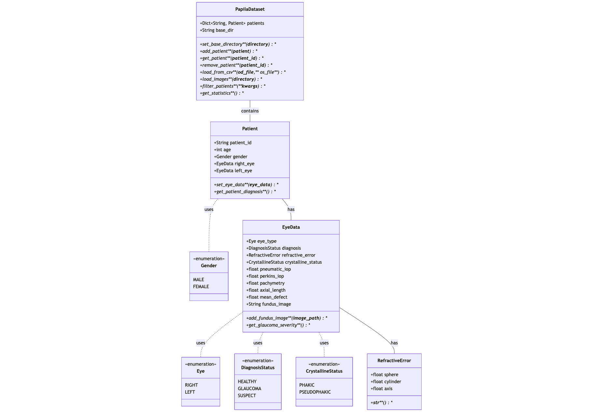

# Proyecto PAPILA: Módulo de Gestión de Imágenes Médicas

Este proyecto implementa un sistema de gestión para el dataset PAPILA (Dataset with fundus images and clinical data of both eyes of the same patient for glaucoma assessment), desarrollado como proyecto final para el módulo "Fundamentos de Ingeniería de Software para Científicos de Datos".

## Descripción

El sistema permite gestionar imágenes de fondo de ojo y sus metadatos clínicos para la evaluación del glaucoma. La implementación se basa en los principios de programación orientada a objetos, modularización y buenas prácticas de programación como la documentación adecuada.

## Estructura del Proyecto

- `papila_classes.py`: Módulo principal que contiene la implementación de las clases del sistema
- `proyecto_papila_modulo.ipynb`: Notebook de Jupyter que muestra ejemplos de uso del sistema
- `diagram_class.png`: Diagrama de clases del sistema
- `README.md`: Este archivo

## Diagrama de Clases

El sistema se compone de varias clases que trabajan juntas para gestionar el dataset PAPILA:



Las principales clases son:

- **PapilaDataset**: Clase principal que gestiona la colección de pacientes
- **Patient**: Representa a un paciente con datos demográficos y referencias a ambos ojos
- **EyeData**: Almacena los datos clínicos y las imágenes de un ojo específico
- **Segmentation**: Representa las segmentaciones del disco óptico y la copa óptica
- **Point**: Representa puntos 2D para las segmentaciones

## Mapeo Dataset PAPILA - Modelo de Clases

| Columna Dataset     | Clase             | Atributo             | Descripción                                       |
|---------------------|-------------------|----------------------|---------------------------------------------------|
| ID                  | `Patient`         | `patient_id`         | Identificador único del paciente                  |
| Age                 | `Patient`         | `age`                | Edad del paciente en años                         |
| Gender              | `Patient`         | `gender`             | Género: MALE(0) o FEMALE(1)                       |
| Diagnosis           | `EyeData`         | `diagnosis`          | HEALTHY(0), GLAUCOMA(1), SUSPECT(2)               |
| dioptre_1           | `RefractiveError` | `sphere`             | Potencia esférica en dioptrías                    |
| dioptre_2           | `RefractiveError` | `cylinder`           | Potencia cilíndrica                               |
| astigmatism         | `RefractiveError` | `axis`               | Eje del astigmatismo en grados                    |
| Phakic/Pseudophakic | `EyeData`         | `crystalline_status` | PHAKIC(0), PSEUDOPHAKIC(1)                        |
| Pneumatic           | `EyeData`         | `pneumatic_iop`      | Presión intraocular (método Neumático en mmHg)    |
| Perkins             | `EyeData`         | `perkins_iop`        | Presión intraocular (método Perkins en mmHg)      |
| Pachymetry          | `EyeData`         | `pachymetry`         | Espesor corneal en μm                             |
| Axial_Length        | `EyeData`         | `axial_length`       | Longitud axial del ojo en mm                      |
| VF_MD               | `EyeData`         | `mean_defect`        | Índice de desviación media del campo visual (dB)  |

## Funcionalidades

El sistema permite:

1. Cargar y gestionar datos clínicos de pacientes
2. Manejar imágenes de fondo de ojo y sus segmentaciones
3. Calcular métricas importantes para el diagnóstico de glaucoma (como CDR)
4. Filtrar pacientes según diversos criterios
5. Generar estadísticas del dataset

## Instalación y Uso

### Requisitos

- Python 3.6 o superior
- Bibliotecas requeridas: numpy, PIL

### Configuración

1. Clona este repositorio:
```bash
git clone https://github.com/IonVillarreal/proyecto_papila_modulo.git
cd proyecto_papila_modulo
```

2. Crea un entorno virtual (opcional pero recomendado):
```bash
python -m venv venv
source venv/bin/activate  # En Windows: venv\Scripts\activate
```

3. Instala las dependencias:
```bash
pip install numpy pillow jupyter
```

### Uso Básico

```python
from papila_classes import *

# Crear un dataset
dataset = PapilaDataset()

# Crear un paciente
patient = Patient(
    patient_id="P001",
    age=65,
    gender=Gender.MALE
)

# Crear datos para el ojo derecho
right_eye = EyeData(
    eye_type=Eye.RIGHT,
    diagnosis=DiagnosisStatus.GLAUCOMA,
    pneumatic_iop=25.0,
    perkins_iop=24.0,
    pachymetry=545.0,
    axial_length=24.5,
    mean_defect=-8.5
)

# Asignar los ojos al paciente
patient.set_eye_data(right_eye)

# Agregar el paciente al dataset
dataset.add_patient(patient)

# Obtener estadísticas
stats = dataset.get_statistics()
print(f"Total de pacientes: {stats['total_patients']}")
```

Para una guía más detallada de uso, consulta el notebook `proyecto_papila_modulo.ipynb`.
